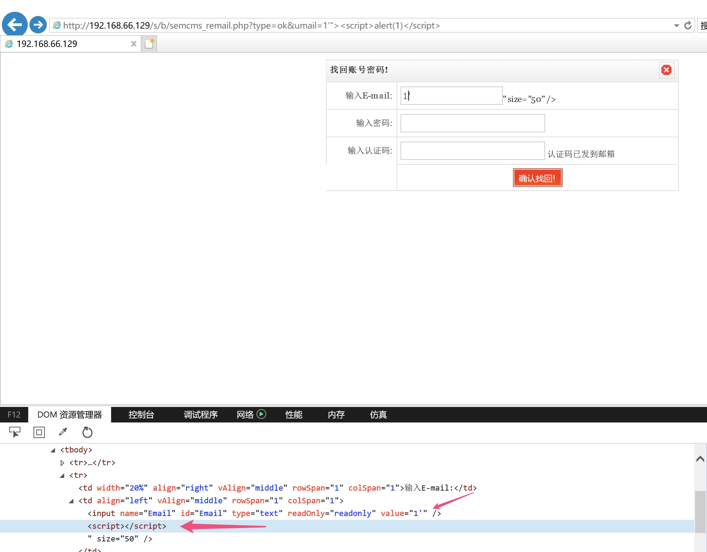
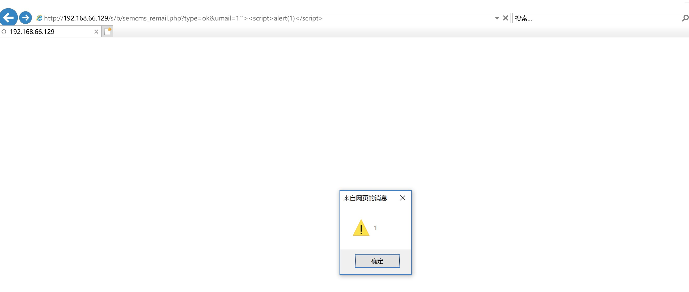

I find a DOM Based XSS in the [SEMCMS](http://www.sem-cms.com/)  
Target URL is `http://192.168.66.129/s/b/semcms_remail.php?type=ok&umail=1`, the umail parameter is unsanitized which result a pop up.  
when we input the url like  `http://192.168.66.129/s/b/semcms_remail.php?type=ok&umail=1'">`  

